# Tutorial do EasyF (tibia-assist)

Este tutorial mostra, passo a passo, como usar o aplicativo desktop **EasyF** - a ferramenta de automação/assistência para Tibia deste repositório. Todas as capturas de tela abaixo foram feitas rodando o app de verdade (`python main.py`, a partir da raiz do repositório) numa sessão já autenticada.

> Nota sobre login: se ao abrir o app pela primeira vez aparecer uma tela de login (campos de email e senha), faça login com sua própria conta - o EasyF exige uma assinatura ativa para funcionar. Nesta sessão de captura o login já estava salvo em `config.json`, então o app abriu direto no Dashboard.

## Índice

1. [Visão geral do Dashboard](#1-visão-geral-do-dashboard)
2. [Tela de Configurações (Settings)](#2-tela-de-configurações-settings)
3. [Logs](#3-logs)
4. [Sobre](#4-sobre)
5. [Configurando o módulo Target](#5-configurando-o-módulo-target)
6. [Configurando o módulo Cavebot](#6-configurando-o-módulo-cavebot)
7. [Configurando o módulo AutoLoot](#7-configurando-o-módulo-autoloot)
8. [Configurando o módulo AutoFishing](#8-configurando-o-módulo-autofishing)
9. [Configurando o módulo RuneMaker](#9-configurando-o-módulo-runemaker)
10. [Configurando o módulo Training](#10-configurando-o-módulo-training)
11. [Auto Food](#11-auto-food)
12. [Fluxo básico de uso](#12-fluxo-básico-de-uso)

---

## 1. Visão geral do Dashboard

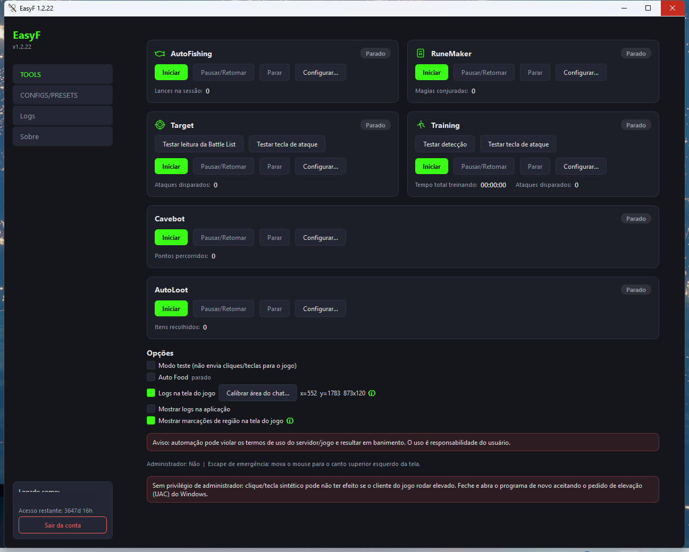

O Dashboard é a tela inicial do EasyF e reúne todos os módulos de automação em forma de cartões (**ModuleCard**). Cada cartão traz:

- Um **selo de estado** no canto superior direito (*Parado*, *Rodando*, *Pausado*).
- Botões **Iniciar**, **Pausar/Retomar**, **Parar** e **Configurar...** (este último abre a tela de configuração específica daquele módulo).
- Um contador simples embaixo (ex: "Lances na sessão", "Pontos percorridos", "Itens recolhidos") que é atualizado em tempo real enquanto o módulo roda.

Os seis módulos disponíveis são **AutoFishing**, **RuneMaker**, **Target**, **Training**, **Cavebot** e **AutoLoot** - cada um detalhado nas seções 5 a 10 abaixo.

Logo abaixo dos cartões fica a seção **Opções**, com ajustes gerais que afetam o app como um todo:

- **Modo teste**: quando marcado, nenhum clique ou tecla real é enviado ao jogo - útil para testar a configuração sem risco.
- **Auto Food**: liga/desliga o módulo de comida automática (não tem tela de configuração própria - veja a seção 11).
- **Logs na tela do jogo** + **Calibrar área do chat...**: mostra um balão de log sobreposto na janela do jogo, posicionado a partir da área do chat que você calibrar (arrastando sobre o painel de mensagens do Tibia).
- **Mostrar logs na aplicação**: exibe (ou esconde) o painel de log dentro do próprio Dashboard.
- **Mostrar marcações de região na tela do jogo**: liga/desliga de uma vez todos os retângulos verdes que marcam visualmente, por cima do jogo, as regiões calibradas (mini mapa, Battle List, bag do corpo etc.) - útil para conferir se uma calibração antiga ainda bate com a tela atual.

No rodapé aparece o aviso de responsabilidade do uso (automação pode violar os termos do jogo), o status de **Administrador** (aqui aparece "Não" porque esta captura foi feita sem elevação; o normal em uso real é rodar como administrador para garantir que cliques/teclas cheguem ao cliente do jogo) e, no canto inferior esquerdo, o card de sessão com a conta logada e o botão **Sair da conta**.

## 2. Tela de Configurações (Settings)

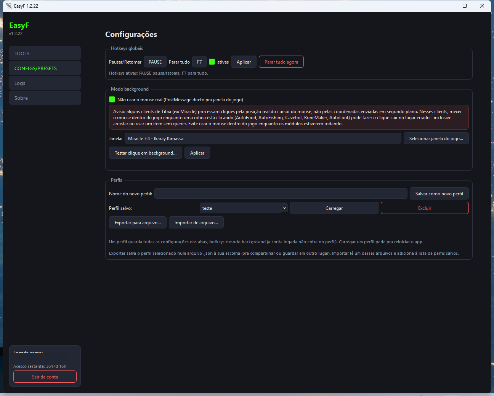

Essa tela fica atrás do item **CONFIGS/PRESETS** na barra lateral (o rótulo do menu é esse, mesmo a tela se chamando "Configurações" internamente). Ela reúne três blocos:

- **Hotkeys globais**: definem a tecla de Pausar/Retomar e a de Parar tudo (funcionam mesmo com o EasyF sem foco, contanto que a caixa "ativas" esteja marcada). O botão **Aplicar** salva a combinação escolhida, e **Parar tudo agora** interrompe todos os módulos na hora.
- **Modo background**: quando marcado, o EasyF envia cliques e teclas direto pra janela do jogo via `PostMessage`, sem mover o cursor real do mouse - assim dá pra usar o PC normalmente enquanto os módulos rodam. **Atenção ao aviso em vermelho**: alguns clients de Tibia (ex: Miracle) leem a posição real do cursor do sistema em vez das coordenadas enviadas em segundo plano - nesses clients, mexer o mouse dentro da janela do jogo enquanto um módulo está clicando pode fazer o clique cair no lugar errado (inclusive arrastar ou usar um item sem querer). A recomendação é não usar o mouse dentro do jogo enquanto os módulos estiverem ativos. Essa seção também tem o botão **Selecionar janela do jogo...** (escolhe qual janela recebe os comandos) e **Testar clique em background...** (valida se o modo está funcionando antes de ativar um módulo de verdade).
- **Perfis**: permite salvar toda a configuração atual (abas, hotkeys, modo background - a conta logada fica de fora) num perfil nomeado, carregar um perfil salvo (pede reinício do app), e exportar/importar perfis como arquivo `.json` para compartilhar ou fazer backup.

## 3. Logs

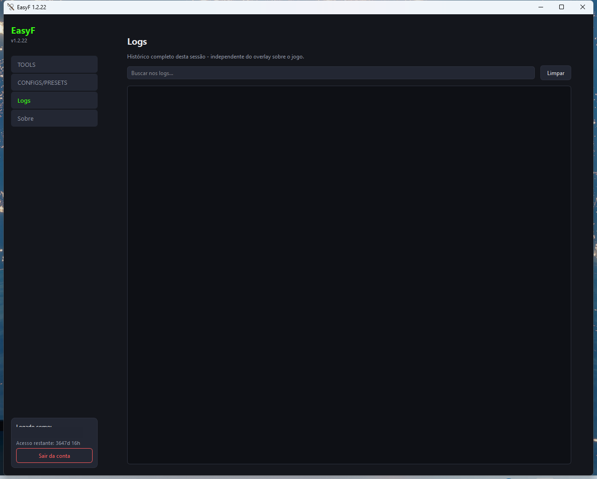

Mostra o histórico completo de mensagens da sessão atual, independente do overlay que aparece sobre o jogo. Tem um campo de busca para filtrar linhas por texto e um botão **Limpar** para esvaziar o histórico.

## 4. Sobre

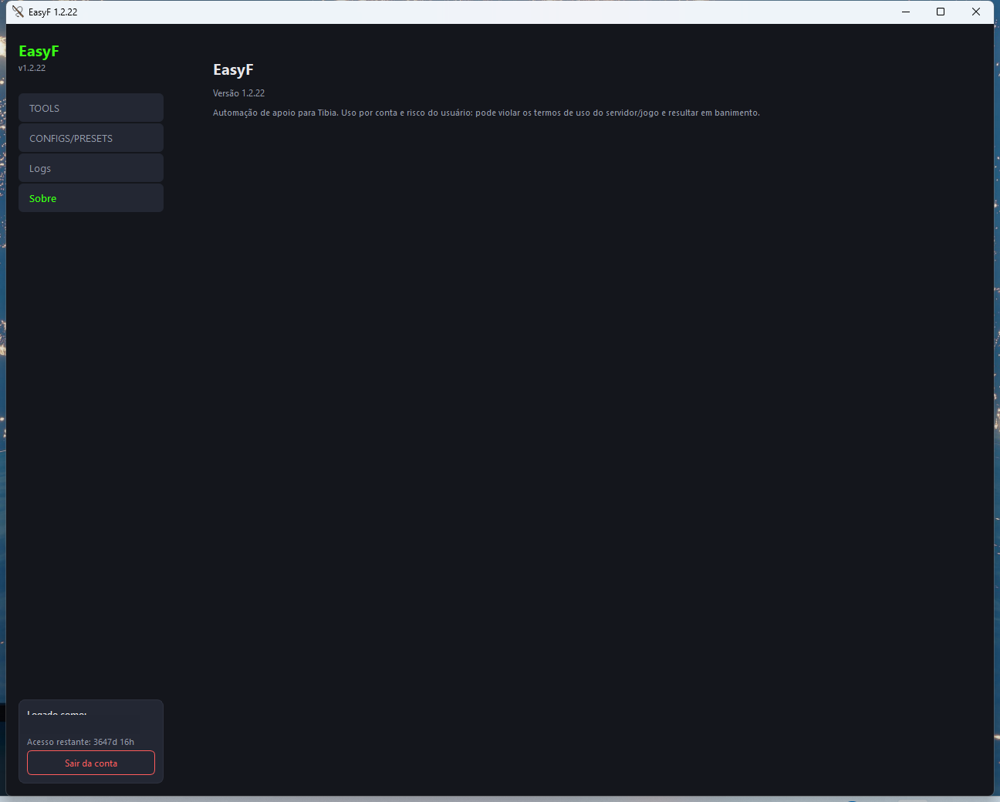

Tela simples com o nome do app, a versão instalada e o aviso de responsabilidade sobre o uso de automação.

## 5. Configurando o módulo Target

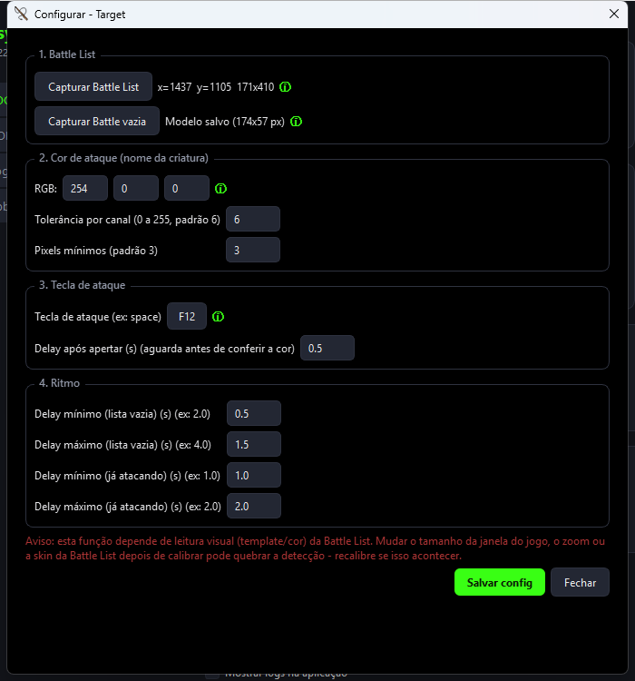

O Target ataca automaticamente a criatura selecionada na Battle List, lendo a tela do jogo (não lê nenhuma API do jogo). A tela de configuração se divide em:

- **1. Battle List**: captura da região onde a Battle List aparece na tela, e um modelo de "Battle List vazia" (recorte do cabeçalho + primeira linha sem monstro) usado para detectar quando não há alvo.
- **2. Cor de ataque**: a cor RGB (padrão vermelho puro `254,0,0`) que aparece no nome da criatura quando ela está em modo de ataque, com tolerância por canal e quantidade mínima de pixels para considerar uma detecção válida.
- **3. Tecla de ataque**: a hotkey configurada dentro do próprio Tibia (Options > Hotkeys > Attack) que o Target aperta repetidamente, e o delay de espera antes de conferir se a cor de ataque apareceu.
- **4. Ritmo**: intervalos mínimo/máximo entre tentativas, tanto com a lista vazia quanto já engajado em combate - variar esses valores deixa o comportamento menos robótico.

O card do Target no Dashboard também tem os botões extras **Testar leitura da Battle List** e **Testar tecla de ataque**, que rodam uma verificação pontual sem precisar iniciar o módulo completo.

## 6. Configurando o módulo Cavebot

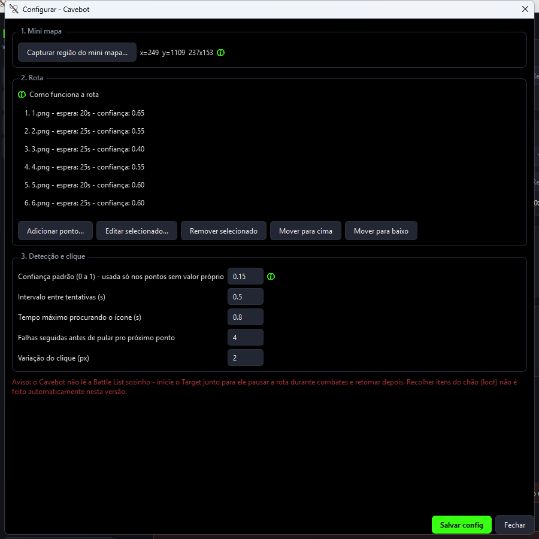

O Cavebot anda automaticamente por uma rota de pontos marcados no mini mapa do jogo. Seções:

- **1. Mini mapa**: captura da região onde o mini mapa aparece na tela - é a base para o reconhecimento de cada marcador da rota.
- **2. Rota**: a lista ordenada de pontos (waypoints). Cada ponto associa um ícone de marcador real do mini mapa (os arquivos `1.png` a `15.png`, recortados na escala exata do jogo), um tempo de espera após o clique, e uma confiança mínima de reconhecimento própria (ou a padrão, se não for definida). Os botões permitem adicionar, editar, remover e reordenar pontos.
- **3. Detecção e clique**: confiança padrão de reconhecimento de ícone, intervalo entre tentativas, tempo máximo de busca, quantas falhas seguidas antes de pular pro próximo ponto, e a variação (jitter) aplicada ao clique para parecer menos robótico.

Um aviso na própria tela lembra que o Cavebot não lê a Battle List sozinho (rode o Target junto para pausar a rota durante combates) e que esta versão não recolhe loot automaticamente durante a rota (isso é papel do módulo AutoLoot).

## 7. Configurando o módulo AutoLoot

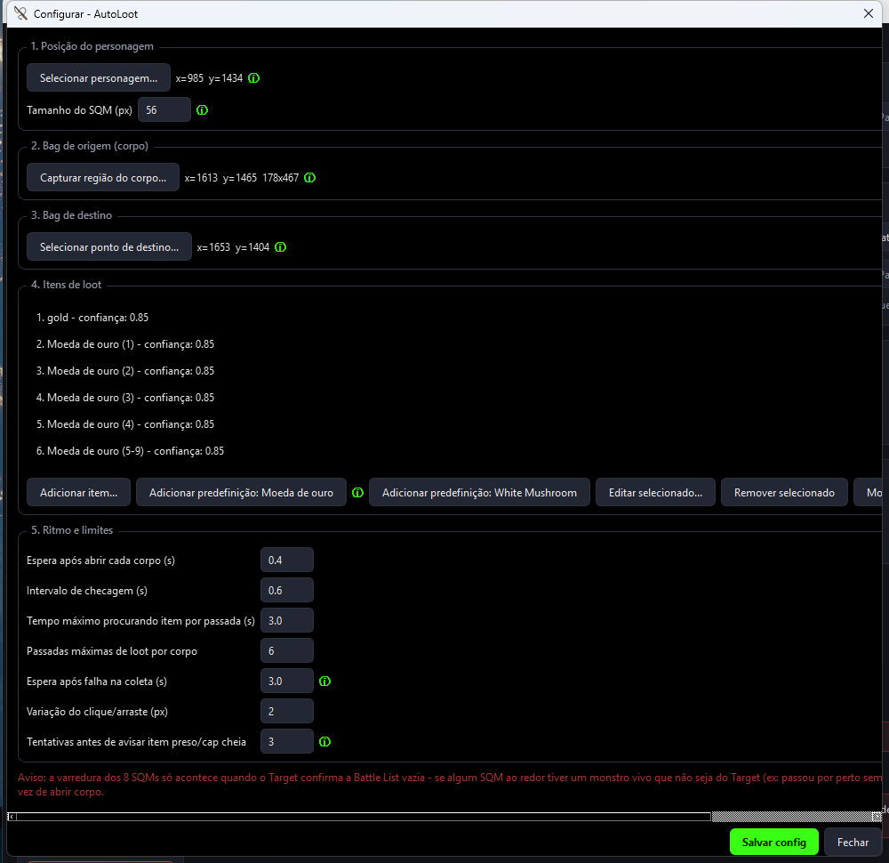

O AutoLoot abre os corpos ao redor do personagem (os 8 SQMs adjacentes) assim que o Target confirma que a Battle List ficou vazia, e recolhe os itens configurados. Seções:

- **1. Posição do personagem**: o ponto na tela onde o personagem fica parado, e o tamanho em pixels de 1 SQM (tile) - usado para calcular os 8 SQMs ao redor.
- **2. Bag de origem (corpo)**: a região onde a bag do corpo aberto aparece na tela (assume que o container sempre abre no mesmo lugar).
- **3. Bag de destino**: o ponto de destino para onde os itens encontrados são arrastados.
- **4. Itens de loot**: lista de itens reconhecidos por ícone (capturado manualmente ou via predefinições prontas de "Moeda de ouro" e "White Mushroom", que já vêm com os ícones embutidos no programa).
- **5. Ritmo e limites**: tempos de espera após abrir cada corpo, intervalo de checagem, tempo máximo procurando item por passada, número de passadas por corpo, variação do clique/arraste e tentativas antes de avisar que um item está preso ou a bag de destino está cheia.

## 8. Configurando o módulo AutoFishing

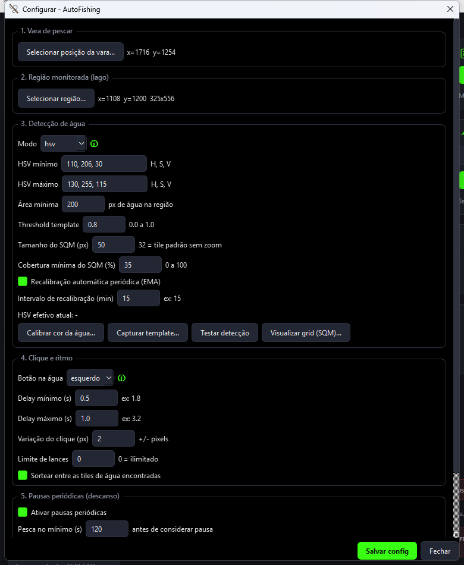

Pesca automaticamente clicando na vara sobre tiles de água detectadas na tela. Seções:

- **1. Vara de pescar**: a posição do slot da vara no inventário.
- **2. Região monitorada (lago)**: a área da tela onde o AutoFishing procura água.
- **3. Detecção de água**: modo de detecção HSV (por cor) ou template (por imagem de referência), com calibração de cor, captura de template, área mínima, tamanho do SQM, cobertura mínima e recalibração automática periódica para compensar variação de brilho dia/noite.
- **4. Clique e ritmo**: botão do mouse usado na água, delays mínimo/máximo entre lances, variação do clique, limite de lances e a opção de sortear entre as tiles de água encontradas.
- **5. Pausas periódicas (descanso)**: simula pausas de descanso depois de um tempo pescando, com duração também variável, para parecer mais natural.

## 9. Configurando o módulo RuneMaker

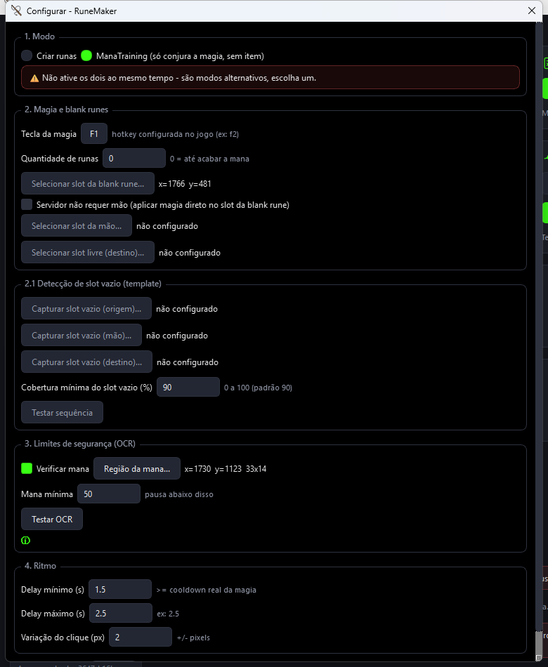

Cria runas (ou só treina mana, conjurando a magia sem gastar item). Seções:

- **1. Modo**: escolha entre **Criar runas** ou **ManaTraining** (só conjura a magia, sem manipular item nenhum) - são modos alternativos, nunca os dois ao mesmo tempo.
- **2. Magia e blank runes**: a hotkey da magia (configurada no jogo), quantidade de runas a criar (0 = até acabar a mana), o slot da blank rune, e a opção "servidor não requer mão" (aplica a magia direto no slot da blank rune, pulando a etapa de segurar o item na mão) com os slots de mão e destino correspondentes.
- **2.1 Detecção de slot vazio**: captura de templates de slot vazio (origem, mão, destino) usados para confirmar que cada etapa da sequência realmente aconteceu, com cobertura mínima configurável.
- **3. Limites de segurança (OCR)**: leitura da mana atual via OCR, com valor mínimo abaixo do qual o módulo pausa.
- **4. Ritmo**: delays mínimo/máximo entre lances e variação do clique.

## 10. Configurando o módulo Training

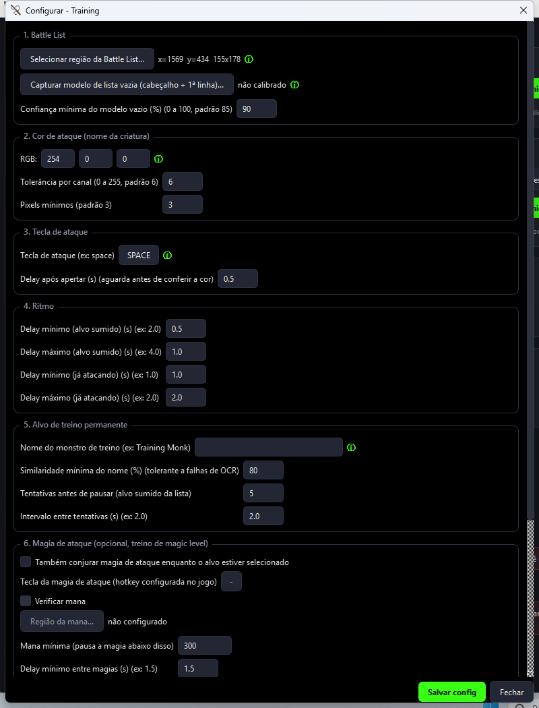

Parecido com o Target, mas focado em treinar contra um monstro específico de treino (ex: Training Monk), com extras de magia e anti-AFK. Seções visíveis na captura:

- **1. Battle List** e **2. Cor de ataque**: mesma lógica do Target (captura de região, modelo de lista vazia, cor RGB de ataque).
- **3. Tecla de ataque** e **4. Ritmo**: tecla de ataque configurada no jogo e delays entre tentativas.
- **5. Alvo de treino permanente**: nome do monstro de treino (lido via OCR na Battle List, tolerante a falhas de leitura), similaridade mínima do nome e tentativas antes de pausar se o alvo sumir da lista.
- **6. Magia de ataque (opcional)**: permite conjurar uma magia de ataque junto com a tecla física, útil para treinar magic level, com verificação de mana própria.

A tela ainda tem uma seção **7. Anti-AFK-kick** (fora da captura, mais abaixo na rolagem) que envia periodicamente um movimento leve (uma tecla e a oposta) para evitar ser desconectado por inatividade, caso a tecla de ataque em loop não conte como atividade no seu servidor.

## 11. Auto Food

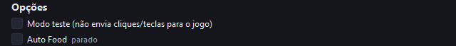

Diferente dos outros seis módulos, o **Auto Food** não tem uma tela de configuração própria - ele é ativado direto pelo checkbox "Auto Food" na seção Opções do Dashboard (ver seção 1). Ao lado do checkbox aparece o estado atual do módulo (ex: "parado").

## 12. Fluxo básico de uso

Um roteiro resumido para começar a usar o EasyF do zero:

1. **Abra o app** rodando `python main.py` a partir da raiz do repositório (ou o executável instalado). Se pedir login, entre com sua conta.
2. **Configure o modo background** em Settings, se quiser continuar usando o PC normalmente enquanto os módulos rodam - lembre-se do aviso sobre clients sensíveis à posição real do cursor (ex: Miracle) e evite mexer o mouse dentro do jogo com os módulos ativos.
3. **Configure o Target primeiro**: capture a região da Battle List, o modelo de lista vazia e confirme a cor de ataque - a maioria dos outros módulos (Cavebot, Training, AutoLoot) depende do Target para saber quando um combate começou ou terminou.
4. **Configure e ative os módulos que for usar** (Cavebot para andar pela rota, AutoLoot para recolher loot, AutoFishing/RuneMaker/Training conforme a necessidade), sempre calibrando as regiões/pontos pedidos com o jogo aberto na tela.
5. **Inicie os módulos** pelos botões **Iniciar** de cada cartão no Dashboard (ou pelas hotkeys globais de pausar/parar tudo configuradas em Settings).
6. **Monitore os Logs** (painel no Dashboard, overlay sobre o jogo, ou a tela de Logs) para acompanhar o que está acontecendo e identificar rapidamente qualquer detecção que pare de funcionar (ex: depois de mudar o zoom ou o tamanho da janela do jogo, o que costuma quebrar calibrações visuais antigas).
